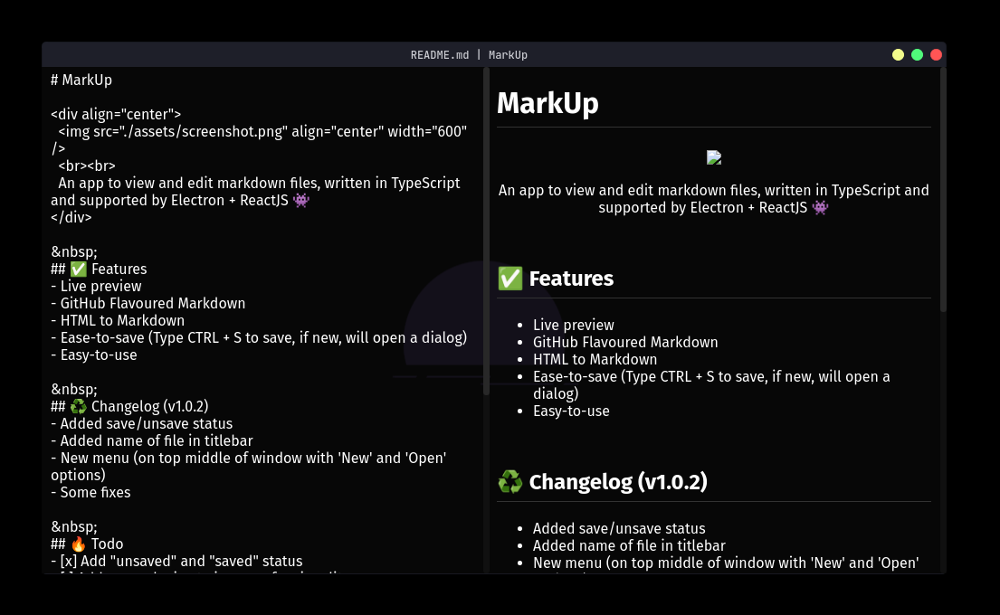

# MarkUp

<div align="center">
  
  <br><br>
  An app to view and edit markdown files, written in TypeScript and supported by Electron + ReactJS 👾
</div>

&nbsp;
## ✅ Features
- Live preview
- GitHub Flavoured Markdown
- HTML to Markdown
- Auto scroll to new content
- Ease-to-save (Type CTRL + S to save, if new, will open a dialog)
- Easy-to-use

&nbsp;
## ♻️ Changelog (v1.0.3)
- Moved menu to left side
- Fixed responsivity
- Solved the bug that when open the dialog and cancel crash the page
- When creating or opening a file, if unsaved, will pop up a dialog to confirm
- When typing a new content on bottom, the viewer will scroll automaticatilly
- Added some pre-built binaries, check [tags](https://github.com/z3oxs/markup/releases/tag/v1.0.3) page
- Some fixes

&nbsp;
## 🔥 Todo
- [x] Add "unsaved" and "saved" status
- [x] Add more plugins to improve funcionality
- [x] Add builds for each platform (Windows, Linux)
- [ ] Ident on tab
- [ ] Remap all styles
- [ ] Better images support

&nbsp;
## 🔧 Setup
- Clone this repository:
```bash
git clone https://github.com/z3oxs/markup
cd markup
```

&nbsp;
- Build:<br>
`yarn build` or `npm run build`

&nbsp;
- Run:<br>
`yarn start` or `npm run start`

&nbsp;
- Create a self-packaged binary (based on your OS):<br>
`yarn package` or `npm run package`
