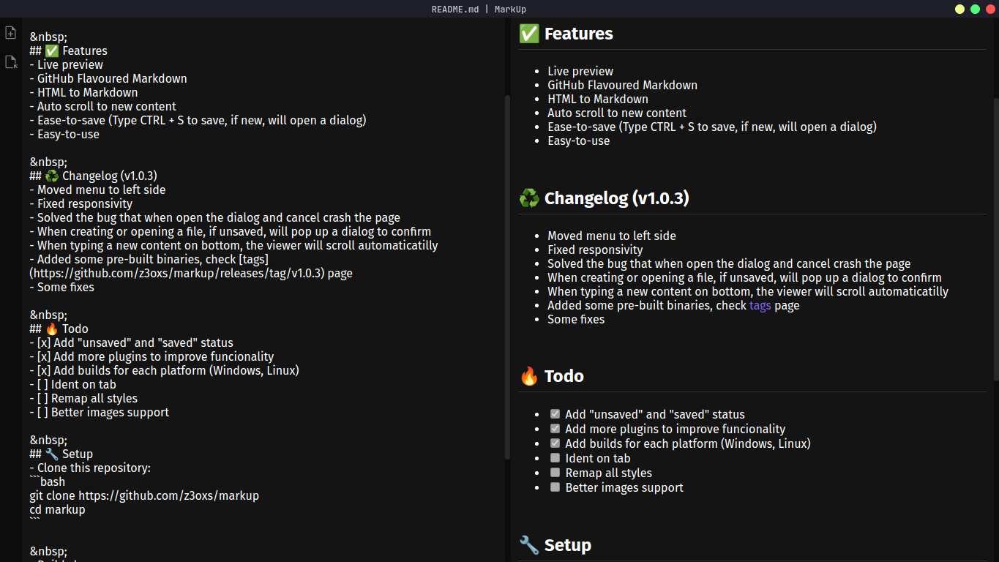

# MarkUp

<div align="center">
  
  <br><br>
  An app to view and edit markdown files, written in TypeScript and supported by Electron + ReactJS 👾
</div>

&nbsp;
## ✅ Features
- Live preview
- GitHub Flavoured Markdown
- HTML to Markdown
- Ease-to-save (Type CTRL + S to save, if new, will open a dialog)
- Easy-to-use

&nbsp;
## ♻️ Changelog (v1.0.2)
- Added save/unsave status
- Added name of file in titlebar
- New menu (on top middle of window with 'New' and 'Open' options)
- Some fixes

&nbsp;
## 🔥 Todo
- [x] Add "unsaved" and "saved" status
- [ ] Add more plugins to improve funcionality
- [ ] Remap all styles
- [ ] Better images support
- [ ] Ident on tab

&nbsp;
## 🔧 Setup
- Clone this repository:
```bash
git clone https://github.com/z3oxs/markup
cd markup
```

&nbsp;
- Run:<br>
`yarn start` or `npm run start`